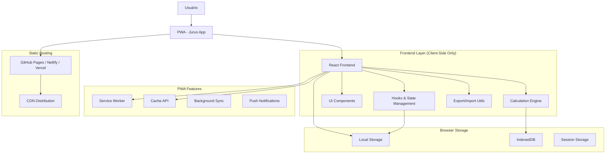
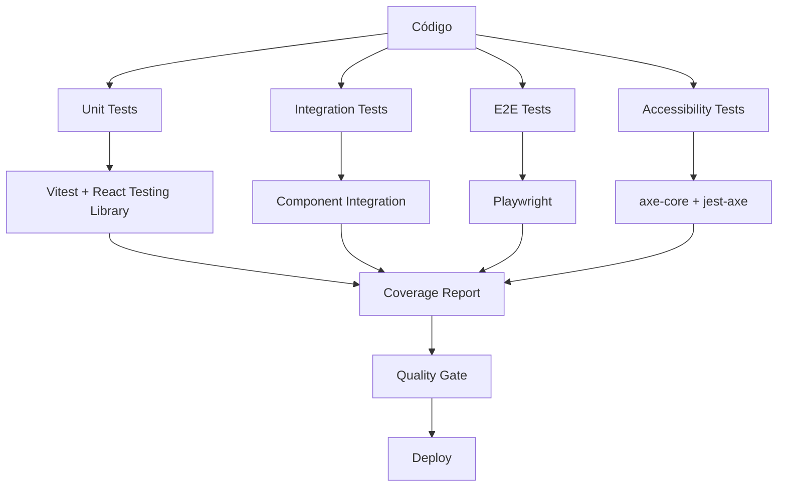

# FASE 4 - ARQUITETURA TÉCNICA
## Projeto Open Source Frontend-Only

## 1. Arquitetura de Design



## 2. Descrição da Tecnologia

**Frontend**: React@18 + TypeScript + Vite + TailwindCSS + Framer Motion
**Storage**: localStorage + IndexedDB + Cache API
**PWA**: Service Workers + Web App Manifest + Workbox
**Testing**: Vitest + React Testing Library + Playwright
**Build**: Vite + Rollup + Bundle Analyzer
**Deploy**: Static hosting (GitHub Pages, Netlify, Vercel)
**Docs**: Storybook + TypeDoc + Docusaurus

### 2.1 Dependências Principais

```json
{
  "dependencies": {
    "react": "^18.2.0",
    "react-dom": "^18.2.0",
    "react-router-dom": "^6.8.0",
    "framer-motion": "^10.0.0",
    "recharts": "^2.5.0",
    "date-fns": "^2.29.0",
    "lucide-react": "^0.220.0",
    "jspdf": "^2.5.1",
    "xlsx": "^0.18.5"
  },
  "devDependencies": {
    "@types/react": "^18.0.0",
    "typescript": "^5.0.0",
    "vite": "^4.3.0",
    "vitest": "^0.30.0",
    "tailwindcss": "^3.3.0",
    "workbox-cli": "^6.5.4",
    "@storybook/react": "^7.0.0"
  }
}
```

## 3. Definições de Rotas

| Rota | Propósito |
|------|-----------|
| `/` | Página inicial com dashboard e acesso rápido |
| `/calculadora` | Calculadora principal de juros compostos |
| `/aposentadoria` | Planejamento de aposentadoria |
| `/metas` | Definição e acompanhamento de metas financeiras |
| `/comparador` | Comparação de investimentos |
| `/cenarios` | Simulador de cenários avançados |
| `/relatorios` | Geração e exportação de relatórios |
| `/historico` | Histórico de simulações salvas |
| `/favoritos` | Simulações marcadas como favoritas |
| `/configuracoes` | Configurações, temas e preferências |
| `/sobre` | Informações sobre o projeto e contribuição |
| `/tutorial` | Tutoriais interativos e onboarding |

## 4. Estrutura de Dados (Local Storage)

### 4.1 Esquema de Dados Locais

```typescript
// Estrutura principal do localStorage
interface JurusLocalData {
  version: string;
  user: UserProfile;
  simulations: Simulation[];
  favorites: string[];
  settings: AppSettings;
  history: HistoryEntry[];
  lastBackup: string;
}

// Perfil do usuário (local)
interface UserProfile {
  id: string;
  name?: string;
  preferences: {
    defaultCurrency: string;
    defaultPeriod: 'monthly' | 'yearly';
    riskTolerance: 'conservative' | 'moderate' | 'aggressive';
    investmentGoals: string[];
  };
  createdAt: string;
  updatedAt: string;
}

// Simulação salva
interface Simulation {
  id: string;
  type: 'compound' | 'retirement' | 'goal' | 'comparison' | 'scenario';
  name: string;
  parameters: Record<string, any>;
  results: CalculationResult;
  tags: string[];
  isFavorite: boolean;
  createdAt: string;
  updatedAt: string;
}

// Configurações da aplicação
interface AppSettings {
  theme: 'light' | 'dark' | 'auto';
  language: 'pt' | 'en' | 'es';
  accessibility: {
    highContrast: boolean;
    reducedMotion: boolean;
    fontSize: 'small' | 'medium' | 'large';
  };
  notifications: {
    enabled: boolean;
    types: string[];
  };
  privacy: {
    analytics: boolean;
    crashReporting: boolean;
  };
}
```

### 4.2 Estratégia de Armazenamento

```typescript
// localStorage para configurações e dados pequenos
const STORAGE_KEYS = {
  USER_PROFILE: 'jurus_user_profile',
  APP_SETTINGS: 'jurus_app_settings',
  LAST_SESSION: 'jurus_last_session'
};

// IndexedDB para simulações e histórico (dados grandes)
const DB_CONFIG = {
  name: 'JurusDB',
  version: 1,
  stores: {
    simulations: 'id, type, createdAt, isFavorite',
    history: 'id, timestamp, type',
    exports: 'id, filename, createdAt'
  }
};
```

## 5. Arquitetura PWA

### 5.1 Service Worker Strategy

```typescript
// Service Worker para cache e offline
const CACHE_STRATEGY = {
  // Cache First para assets estáticos
  static: {
    strategy: 'CacheFirst',
    cacheName: 'jurus-static-v1',
    patterns: ['/assets/', '/icons/', '/fonts/']
  },
  
  // Network First para dados dinâmicos
  dynamic: {
    strategy: 'NetworkFirst',
    cacheName: 'jurus-dynamic-v1',
    patterns: ['/api/', '/data/']
  },
  
  // Stale While Revalidate para páginas
  pages: {
    strategy: 'StaleWhileRevalidate',
    cacheName: 'jurus-pages-v1',
    patterns: ['/']
  }
};
```

### 5.2 Manifest Configuration

```json
{
  "name": "Jurus - Calculadora Financeira",
  "short_name": "Jurus",
  "description": "Ferramenta gratuita para cálculos financeiros e planejamento de investimentos",
  "start_url": "/",
  "display": "standalone",
  "background_color": "#1f2937",
  "theme_color": "#2563eb",
  "orientation": "portrait-primary",
  "categories": ["finance", "education", "productivity"],
  "icons": [
    {
      "src": "/icons/icon-192.png",
      "sizes": "192x192",
      "type": "image/png",
      "purpose": "any maskable"
    },
    {
      "src": "/icons/icon-512.png",
      "sizes": "512x512",
      "type": "image/png",
      "purpose": "any maskable"
    }
  ]
}
```

## 6. Sistema de Testes

### 6.1 Estratégia de Testes



### 6.2 Configuração de Testes

```typescript
// vitest.config.ts
export default defineConfig({
  test: {
    environment: 'jsdom',
    setupFiles: ['./src/test/setup.ts'],
    coverage: {
      provider: 'v8',
      reporter: ['text', 'html', 'lcov'],
      threshold: {
        global: {
          branches: 85,
          functions: 85,
          lines: 85,
          statements: 85
        }
      }
    }
  }
});

// Testes de acessibilidade
describe('Accessibility Tests', () => {
  it('should not have accessibility violations', async () => {
    const { container } = render(<App />);
    const results = await axe(container);
    expect(results).toHaveNoViolations();
  });
});
```

## 7. Performance e Otimização

### 7.1 Bundle Optimization

```typescript
// vite.config.ts - Code Splitting
export default defineConfig({
  build: {
    rollupOptions: {
      output: {
        manualChunks: {
          vendor: ['react', 'react-dom'],
          charts: ['recharts'],
          utils: ['date-fns', 'lodash'],
          ui: ['framer-motion', 'lucide-react']
        }
      }
    },
    chunkSizeWarningLimit: 500
  }
});
```

### 7.2 Lazy Loading Strategy

```typescript
// Lazy loading de componentes
const CalculadoraAposentadoria = lazy(() => 
  import('./components/CalculadoraAposentadoria')
);

const SimuladorCenarios = lazy(() => 
  import('./components/SimuladorCenarios')
);

const RelatoriosAvancados = lazy(() => 
  import('./components/RelatoriosAvancados')
);

// Preload crítico
const preloadComponents = () => {
  import('./components/CalculadoraAposentadoria');
  import('./components/SimuladorCenarios');
};
```

## 8. Segurança Frontend

### 8.1 Content Security Policy

```html
<meta http-equiv="Content-Security-Policy" content="
  default-src 'self';
  script-src 'self' 'unsafe-inline';
  style-src 'self' 'unsafe-inline' https://fonts.googleapis.com;
  font-src 'self' https://fonts.gstatic.com;
  img-src 'self' data: https:;
  connect-src 'self';
  frame-ancestors 'none';
  base-uri 'self';
  form-action 'self';
">
```

### 8.2 Validação de Dados

```typescript
// Validação robusta de inputs
import { z } from 'zod';

const SimulationSchema = z.object({
  initialAmount: z.number().min(0).max(1000000000),
  monthlyContribution: z.number().min(0).max(10000000),
  interestRate: z.number().min(0).max(100),
  period: z.number().min(1).max(600),
  compoundFrequency: z.enum(['monthly', 'quarterly', 'yearly'])
});

// Sanitização de dados
const sanitizeInput = (input: string): string => {
  return input
    .replace(/<script\b[^<]*(?:(?!<\/script>)<[^<]*)*<\/script>/gi, '')
    .replace(/[<>]/g, '');
};
```

## 9. Deploy e Distribuição

### 9.1 Build Pipeline

```yaml
# GitHub Actions - .github/workflows/deploy.yml
name: Deploy to GitHub Pages

on:
  push:
    branches: [ main ]

jobs:
  build-and-deploy:
    runs-on: ubuntu-latest
    steps:
      - uses: actions/checkout@v3
      
      - name: Setup Node.js
        uses: actions/setup-node@v3
        with:
          node-version: '18'
          cache: 'npm'
      
      - name: Install dependencies
        run: npm ci
      
      - name: Run tests
        run: npm run test:coverage
      
      - name: Build application
        run: npm run build
      
      - name: Deploy to GitHub Pages
        uses: peaceiris/actions-gh-pages@v3
        with:
          github_token: ${{ secrets.GITHUB_TOKEN }}
          publish_dir: ./dist
```

### 9.2 Hosting Options

| Plataforma | Vantagens | Configuração |
|------------|-----------|--------------|
| **GitHub Pages** | Gratuito, integração Git, domínio customizável | Automático via Actions |
| **Netlify** | Deploy contínuo, edge functions, forms | Conectar repositório |
| **Vercel** | Performance otimizada, analytics, preview deploys | Import do GitHub |
| **Cloudflare Pages** | CDN global, Workers, analytics | Conectar repositório |

## 10. Monitoramento e Analytics

### 10.1 Performance Monitoring

```typescript
// Web Vitals tracking (opcional, respeitando privacidade)
import { getCLS, getFID, getFCP, getLCP, getTTFB } from 'web-vitals';

const sendToAnalytics = (metric: any) => {
  // Apenas se usuário consentir
  if (userSettings.privacy.analytics) {
    // Log local ou envio para serviço de analytics
    console.log('Performance metric:', metric);
  }
};

getCLS(sendToAnalytics);
getFID(sendToAnalytics);
getFCP(sendToAnalytics);
getLCP(sendToAnalytics);
getTTFB(sendToAnalytics);
```

### 10.2 Error Tracking

```typescript
// Error boundary para captura de erros
class ErrorBoundary extends Component {
  componentDidCatch(error: Error, errorInfo: ErrorInfo) {
    // Log local de erros
    console.error('Application error:', error, errorInfo);
    
    // Salvar no localStorage para debug
    const errorLog = {
      error: error.message,
      stack: error.stack,
      timestamp: new Date().toISOString(),
      userAgent: navigator.userAgent
    };
    
    const existingLogs = JSON.parse(
      localStorage.getItem('jurus_error_logs') || '[]'
    );
    
    existingLogs.push(errorLog);
    localStorage.setItem('jurus_error_logs', JSON.stringify(existingLogs));
  }
}
```

## 11. Documentação e Contribuição

### 11.1 Estrutura de Documentação

```
docs/
├── README.md                 # Visão geral do projeto
├── CONTRIBUTING.md          # Guia de contribuição
├── CODE_OF_CONDUCT.md       # Código de conduta
├── LICENSE.md               # Licença MIT
├── CHANGELOG.md             # Histórico de mudanças
├── api/                     # Documentação da API
├── components/              # Documentação de componentes
├── tutorials/               # Tutoriais de uso
└── development/             # Guias de desenvolvimento
```

### 11.2 Storybook Configuration

```typescript
// .storybook/main.ts
export default {
  stories: ['../src/**/*.stories.@(js|jsx|ts|tsx)'],
  addons: [
    '@storybook/addon-essentials',
    '@storybook/addon-a11y',
    '@storybook/addon-docs'
  ],
  framework: {
    name: '@storybook/react-vite',
    options: {}
  }
};
```

## 12. Roadmap Técnico

### 12.1 Fase 4.1 - Fundação (Semana 1)
- ✅ Configuração de testes unitários e integração
- ✅ Implementação de PWA básico
- ✅ Otimização de performance inicial
- ✅ Configuração de CI/CD

### 12.2 Fase 4.2 - PWA Avançado (Semana 2)
- 🔄 Service Workers com cache strategies
- 🔄 Funcionalidade offline completa
- 🔄 Background sync para dados
- 🔄 Push notifications (opcional)

### 12.3 Fase 4.3 - Qualidade (Semana 3)
- 📋 Testes E2E com Playwright
- 📋 Auditoria de acessibilidade completa
- 📋 Performance optimization avançada
- 📋 Security audit

### 12.4 Fase 4.4 - Lançamento (Semana 4)
- 🚀 Deploy em produção
- 🚀 Documentação completa
- 🚀 Guias de contribuição
- 🚀 Lançamento open source

## 13. Considerações Finais

Esta arquitetura frontend-only garante:

- **Simplicidade**: Sem complexidade de backend
- **Privacidade**: Dados nunca saem do dispositivo
- **Performance**: Carregamento rápido e responsivo
- **Acessibilidade**: Funciona offline e em qualquer dispositivo
- **Escalabilidade**: Fácil de hospedar e distribuir
- **Manutenibilidade**: Código limpo e bem documentado
- **Contribuição**: Open source facilita colaboração

O resultado é uma aplicação robusta, segura e acessível que serve como referência em desenvolvimento frontend moderno e educação financeira digital.