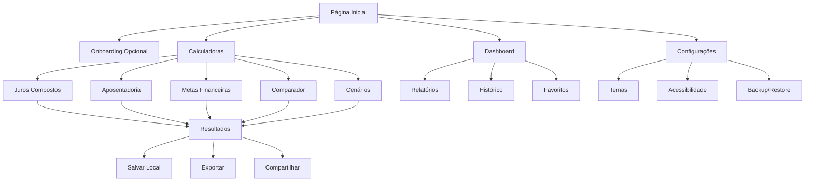

# FASE 4 - FINALIZAÇÃO E POLIMENTO
## Product Requirements Document (PRD)

## 1. Visão Geral do Produto

A plataforma **Jurus** é uma ferramenta educativa **100% gratuita e open source** para cálculos financeiros avançados, focada em democratizar o acesso ao conhecimento financeiro. Sem necessidade de cadastro ou autenticação, oferece acesso imediato a todas as funcionalidades, com dados salvos localmente no navegador do usuário.

**Missão**: Tornar a educação financeira acessível a todos, sem barreiras ou custos.

**Valores**:
- **Livre e Aberto**: Código fonte disponível, sem restrições
- **Privacidade**: Dados permanecem no dispositivo do usuário
- **Acessibilidade**: Funciona para todos, em qualquer dispositivo
- **Educação**: Foco no aprendizado e capacitação financeira

## 2. Funcionalidades Principais

### 2.1 Perfil de Usuário (Sem Autenticação)
- **Armazenamento Local**: Todas as preferências salvas no localStorage
- **Perfis Múltiplos**: Usuário pode criar diferentes perfis localmente
- **Exportação/Importação**: Backup e restauração de dados via arquivos JSON
- **Privacidade Total**: Nenhum dado enviado para servidores externos

### 2.2 Módulos Principais

**Calculadoras Financeiras**:
1. **Juros Compostos Avançados**: Cálculos complexos com múltiplas variáveis
2. **Planejamento de Aposentadoria**: Simulações de longo prazo
3. **Metas Financeiras**: Planejamento de objetivos específicos
4. **Comparador de Investimentos**: Análise comparativa de produtos
5. **Simulador de Cenários**: Monte Carlo e análise de sensibilidade
6. **Calculadora de Imposto de Renda**: Otimização fiscal

**Funcionalidades Avançadas**:
- **Dashboard Executivo**: Visão consolidada de todas as simulações
- **Relatórios Avançados**: Exportação em PDF, Excel, CSV
- **Análise de Cenários**: Simulações complexas e backtesting
- **Sistema de Favoritos**: Salvar e organizar simulações
- **Histórico Completo**: Todas as simulações salvas localmente

### 2.3 Detalhamento das Páginas

| Página | Módulo | Descrição das Funcionalidades |
|--------|--------|-------------------------------|
| **Home** | Dashboard Principal | Acesso rápido a todas as calculadoras, resumo de simulações recentes, tutoriais interativos |
| **Juros Compostos** | Calculadora Principal | Cálculos avançados, gráficos interativos, análise de sensibilidade, comparação de cenários |
| **Planejamento** | Aposentadoria | Simulações de longo prazo, múltiplas fontes de renda, inflação, expectativa de vida |
| **Metas** | Objetivos Financeiros | Planejamento de metas, cronogramas, alertas de progresso, ajustes automáticos |
| **Comparador** | Análise Comparativa | Comparação de produtos financeiros, ranking automático, análise de risco/retorno |
| **Cenários** | Simulação Avançada | Monte Carlo, stress testing, análise de correlação, backtesting histórico |
| **Relatórios** | Exportação | Relatórios personalizados, templates profissionais, múltiplos formatos |
| **Configurações** | Personalização | Temas, acessibilidade, preferências de cálculo, backup/restore |

## 3. Fluxo Principal do Usuário

### 3.1 Jornada do Usuário
1. **Acesso Imediato**: Usuário acessa a plataforma sem necessidade de cadastro
2. **Onboarding Interativo**: Tutorial opcional para conhecer as funcionalidades
3. **Uso Livre**: Acesso completo a todas as calculadoras e funcionalidades
4. **Personalização**: Configuração de preferências salvas localmente
5. **Produtividade**: Uso contínuo com histórico e favoritos salvos
6. **Compartilhamento**: Exportação de resultados e configurações

### 3.2 Fluxograma de Navegação

## 4. Design e Interface

### 4.1 Princípios de Design
- **Acessibilidade Universal**: WCAG 2.1 AA compliance
- **Design Inclusivo**: Funciona para todos os usuários
- **Performance**: Carregamento rápido, responsivo
- **Offline-First**: Funciona sem conexão à internet

### 4.2 Estilo Visual

**Paleta de Cores**:
- **Primária**: #2563eb (Azul profissional)
- **Secundária**: #10b981 (Verde crescimento)
- **Accent**: #f59e0b (Dourado valorização)
- **Neutros**: #1f2937, #6b7280, #f9fafb

**Tipografia**:
- **Títulos**: Inter Bold (24px, 20px, 18px)
- **Corpo**: Inter Regular (16px, 14px)
- **Dados**: JetBrains Mono (números e valores)

**Componentes**:
- **Botões**: Rounded corners (8px), hover effects, focus states
- **Cards**: Subtle shadows, clean borders, hover animations
- **Inputs**: Clear labels, validation states, accessibility features
- **Gráficos**: Interactive charts, responsive design, color-blind friendly

### 4.3 Layout e Responsividade

| Dispositivo | Breakpoint | Layout |
|-------------|------------|--------|
| **Mobile** | < 768px | Stack vertical, menu hamburger, touch-optimized |
| **Tablet** | 768px - 1024px | Grid 2 colunas, sidebar colapsível |
| **Desktop** | > 1024px | Grid 3 colunas, sidebar fixa, multi-panel |

### 4.4 Acessibilidade

**Recursos Implementados**:
- **Navegação por teclado**: Tab order lógico, shortcuts
- **Screen readers**: ARIA labels, semantic HTML
- **Alto contraste**: Modo de alto contraste disponível
- **Zoom**: Suporte até 200% sem perda de funcionalidade
- **Movimento reduzido**: Respeita preferências do sistema
- **Múltiplos idiomas**: Português, Inglês, Espanhol

## 5. Requisitos Técnicos

### 5.1 Performance
- **First Contentful Paint**: < 1.5s
- **Largest Contentful Paint**: < 2.5s
- **Cumulative Layout Shift**: < 0.1
- **Bundle Size**: < 500KB gzipped
- **Lighthouse Score**: > 95 em todas as métricas

### 5.2 Compatibilidade
- **Navegadores**: Chrome 90+, Firefox 88+, Safari 14+, Edge 90+
- **Dispositivos**: Desktop, tablet, mobile
- **Sistemas**: Windows, macOS, Linux, iOS, Android
- **Offline**: Funcionalidade completa sem internet (PWA)

### 5.3 Segurança e Privacidade
- **Dados Locais**: Tudo armazenado no localStorage do navegador
- **Sem Tracking**: Nenhum analytics ou tracking de usuário
- **HTTPS**: Servido apenas via conexão segura
- **CSP**: Content Security Policy rigorosa
- **Open Source**: Código auditável publicamente

## 6. Critérios de Sucesso

### 6.1 Métricas de Qualidade
- **Cobertura de Testes**: > 85%
- **Acessibilidade**: WCAG 2.1 AA (100%)
- **Performance**: Lighthouse > 95
- **SEO**: Score > 90
- **PWA**: Installable, offline-capable

### 6.2 Métricas de Uso
- **Tempo de Carregamento**: < 2s
- **Taxa de Rejeição**: < 30%
- **Sessões por Usuário**: > 3
- **Funcionalidades Utilizadas**: > 70% dos módulos
- **Satisfação**: NPS > 70 (quando implementado feedback)

### 6.3 Impacto Educacional
- **Democratização**: Acesso livre a ferramentas financeiras profissionais
- **Educação**: Tutoriais e explicações integradas
- **Transparência**: Código aberto para aprendizado
- **Comunidade**: Base para contribuições e melhorias

## 7. Roadmap de Lançamento

### 7.1 Fase 4.1 - Testes e Qualidade (Semana 1)
- Implementação de testes unitários e integração
- Validação de acessibilidade
- Otimização de performance
- Auditoria de segurança

### 7.2 Fase 4.2 - PWA e Offline (Semana 2)
- Service Workers
- Cache strategies
- Funcionalidade offline completa
- Instalação como app

### 7.3 Fase 4.3 - Documentação (Semana 3)
- Documentação técnica completa
- Guias de contribuição
- Tutoriais de uso
- API documentation

### 7.4 Fase 4.4 - Deploy e Lançamento (Semana 4)
- Deploy em plataforma estática
- Configuração de domínio
- Lançamento público
- Divulgação open source

## 8. Considerações Finais

A **Fase 4** transforma o Jurus em uma ferramenta educativa de classe mundial, totalmente gratuita e acessível. O foco em open source e privacidade do usuário diferencia a plataforma no mercado, criando valor através da utilidade pública e impacto educacional.

**Visão de Futuro**: Tornar-se a referência em educação financeira digital, com uma comunidade ativa de contribuidores e usuários engajados na democratização do conhecimento financeiro.