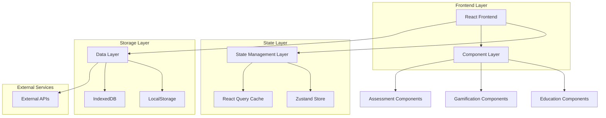

# Arquitetura Técnica - Expansão Educação Financeira

## 1. Arquitetura Geral

### 1.1 Diagrama de Arquitetura



### 1.2 Tecnologias Principais

- **Frontend**: React 18 + TypeScript + Tailwind CSS + Framer Motion
- **State**: Zustand + React Query
- **Storage**: LocalStorage + IndexedDB
- **Build**: Vite + SWC
- **Testing**: Vitest + Testing Library

## 2. Estrutura de Componentes

### 2.1 Hierarquia de Componentes

```
src/
├── components/
│   ├── educacao/
│   │   ├── gamification/
│   │   │   ├── BadgeSystem.tsx
│   │   │   ├── ProgressBar.tsx
│   │   │   ├── LevelIndicator.tsx
│   │   │   └── AchievementModal.tsx
│   │   ├── learning/
│   │   │   ├── LearningTrack.tsx
│   │   │   ├── ModuleCard.tsx
│   │   │   ├── ContentViewer.tsx
│   │   │   └── ProgressTracker.tsx
│   │   ├── assessment/
│   │   │   ├── QuizEngine.tsx
│   │   │   ├── QuestionCard.tsx
│   │   │   ├── ResultsPanel.tsx
│   │   │   └── FeedbackModal.tsx
│   │   ├── calculators/
│   │   │   ├── RetirementCalculator.tsx
│   │   │   ├── LoanCalculator.tsx
│   │   │   ├── InvestmentComparator.tsx
│   │   │   └── CalculatorBase.tsx
│   │   ├── content/
│   │   │   ├── ArticleViewer.tsx
│   │   │   ├── VideoPlayer.tsx
│   │   │   ├── PodcastPlayer.tsx
│   │   │   └── ContentLibrary.tsx
│   │   └── certification/
│   │       ├── CertificateGenerator.tsx
│   │       ├── CertificateViewer.tsx
│   │       └── CertificateGallery.tsx
│   └── ui/
│       ├── charts/
│       ├── forms/
│       └── feedback/
```

### 2.2 Componentes Base Reutilizáveis

#### 2.2.1 EducationCard
```typescript
interface EducationCardProps {
  title: string;
  description: string;
  progress?: number;
  difficulty: 'basic' | 'intermediate' | 'advanced';
  xpReward: number;
  isLocked?: boolean;
  onStart: () => void;
}
```

#### 2.2.2 ProgressIndicator
```typescript
interface ProgressIndicatorProps {
  current: number;
  total: number;
  showPercentage?: boolean;
  animated?: boolean;
  color?: 'primary' | 'secondary' | 'success';
}
```

#### 2.2.3 BadgeDisplay
```typescript
interface BadgeDisplayProps {
  badge: Badge;
  size?: 'sm' | 'md' | 'lg';
  showTooltip?: boolean;
  animated?: boolean;
}
```

## 3. Gerenciamento de Estado

### 3.1 Zustand Stores

#### 3.1.1 Education Store
```typescript
interface EducationState {
  // User Progress
  userProgress: UserProgress;
  currentTrack: LearningTrack | null;
  currentModule: Module | null;
  
  // Gamification
  xp: number;
  level: number;
  badges: Badge[];
  achievements: Achievement[];
  
  // Content
  completedContent: string[];
  bookmarkedContent: string[];
  
  // Actions
  updateProgress: (moduleId: string) => void;
  addXP: (amount: number) => void;
  unlockBadge: (badgeId: string) => void;
  setCurrentModule: (module: Module) => void;
}
```

#### 3.1.2 Assessment Store
```typescript
interface AssessmentState {
  // Current Quiz
  currentQuiz: Quiz | null;
  currentQuestion: number;
  answers: Record<string, any>;
  timeSpent: number;
  
  // Results
  quizResults: QuizResult[];
  overallScore: number;
  
  // Actions
  startQuiz: (quizId: string) => void;
  submitAnswer: (questionId: string, answer: any) => void;
  finishQuiz: () => void;
  resetQuiz: () => void;
}
```

### 3.2 React Query Hooks

#### 3.2.1 Content Queries
```typescript
// Fetch learning tracks
export const useLearningTracks = () => {
  return useQuery({
    queryKey: ['learning-tracks'],
    queryFn: fetchLearningTracks,
    staleTime: 1000 * 60 * 30, // 30 minutes
  });
};

// Fetch module content
export const useModuleContent = (moduleId: string) => {
  return useQuery({
    queryKey: ['module-content', moduleId],
    queryFn: () => fetchModuleContent(moduleId),
    enabled: !!moduleId,
  });
};
```

#### 3.2.2 Progress Mutations
```typescript
// Update user progress
export const useUpdateProgress = () => {
  const queryClient = useQueryClient();
  
  return useMutation({
    mutationFn: updateUserProgress,
    onSuccess: () => {
      queryClient.invalidateQueries(['user-progress']);
    },
  });
};
```

## 4. Tipos e Interfaces

### 4.1 Core Types

```typescript
// User and Progress
interface UserProgress {
  id: string;
  xp: number;
  level: number;
  completedModules: string[];
  completedTracks: string[];
  badges: Badge[];
  certificates: Certificate[];
  createdAt: Date;
  updatedAt: Date;
}

// Learning Content
interface LearningTrack {
  id: string;
  title: string;
  description: string;
  difficulty: DifficultyLevel;
  estimatedTime: number; // in minutes
  modules: Module[];
  prerequisites: string[];
  xpReward: number;
  badge?: Badge;
}

interface Module {
  id: string;
  title: string;
  description: string;
  content: Content[];
  quiz?: Quiz;
  estimatedTime: number;
  xpReward: number;
  order: number;
}

interface Content {
  id: string;
  type: 'article' | 'video' | 'interactive' | 'calculator';
  title: string;
  data: any; // Specific to content type
  estimatedTime: number;
}

// Gamification
interface Badge {
  id: string;
  name: string;
  description: string;
  icon: string;
  rarity: 'common' | 'rare' | 'epic' | 'legendary';
  unlockedAt?: Date;
}

interface Achievement {
  id: string;
  name: string;
  description: string;
  condition: AchievementCondition;
  xpReward: number;
  badge?: Badge;
}

// Assessment
interface Quiz {
  id: string;
  title: string;
  description: string;
  questions: Question[];
  timeLimit?: number; // in minutes
  passingScore: number; // percentage
  xpReward: number;
}

interface Question {
  id: string;
  type: 'multiple-choice' | 'true-false' | 'numeric' | 'drag-drop';
  question: string;
  options?: string[];
  correctAnswer: any;
  explanation: string;
  points: number;
}

interface QuizResult {
  id: string;
  quizId: string;
  userId: string;
  score: number;
  totalQuestions: number;
  correctAnswers: number;
  timeSpent: number;
  answers: QuestionAnswer[];
  completedAt: Date;
}

// Calculators
interface CalculatorConfig {
  id: string;
  type: 'retirement' | 'loan' | 'investment' | 'comparison';
  title: string;
  description: string;
  inputs: CalculatorInput[];
  outputs: CalculatorOutput[];
}

interface CalculatorInput {
  id: string;
  label: string;
  type: 'number' | 'percentage' | 'currency' | 'date' | 'select';
  required: boolean;
  defaultValue?: any;
  validation?: ValidationRule[];
}
```

### 4.2 Utility Types

```typescript
type DifficultyLevel = 'basic' | 'intermediate' | 'advanced';
type ContentType = 'article' | 'video' | 'interactive' | 'calculator';
type BadgeRarity = 'common' | 'rare' | 'epic' | 'legendary';

// Generic API Response
interface ApiResponse<T> {
  data: T;
  success: boolean;
  message?: string;
  errors?: string[];
}

// Pagination
interface PaginatedResponse<T> {
  data: T[];
  pagination: {
    page: number;
    limit: number;
    total: number;
    totalPages: number;
  };
}
```

## 5. Hooks Customizados

### 5.1 Education Hooks

#### 5.1.1 useEducationProgress
```typescript
export const useEducationProgress = () => {
  const { userProgress, updateProgress } = useEducationStore();
  
  const calculateLevel = useCallback((xp: number) => {
    return Math.floor(xp / 1000) + 1;
  }, []);
  
  const getXPForNextLevel = useCallback((currentLevel: number) => {
    return currentLevel * 1000;
  }, []);
  
  const addXP = useCallback((amount: number) => {
    const newXP = userProgress.xp + amount;
    const newLevel = calculateLevel(newXP);
    
    updateProgress({
      xp: newXP,
      level: newLevel,
    });
    
    // Check for level up
    if (newLevel > userProgress.level) {
      // Trigger level up animation/notification
      return { levelUp: true, newLevel };
    }
    
    return { levelUp: false, newLevel };
  }, [userProgress, updateProgress, calculateLevel]);
  
  return {
    userProgress,
    addXP,
    calculateLevel,
    getXPForNextLevel,
  };
};
```

#### 5.1.2 useGamification
```typescript
export const useGamification = () => {
  const { badges, achievements, unlockBadge } = useEducationStore();
  
  const checkAchievements = useCallback((action: string, data: any) => {
    // Logic to check if any achievements should be unlocked
    // based on the action performed
  }, []);
  
  const unlockAchievement = useCallback((achievementId: string) => {
    // Logic to unlock achievement and associated badge
  }, []);
  
  return {
    badges,
    achievements,
    checkAchievements,
    unlockAchievement,
  };
};
```

### 5.2 Assessment Hooks

#### 5.2.1 useQuiz
```typescript
export const useQuiz = (quizId: string) => {
  const {
    currentQuiz,
    currentQuestion,
    answers,
    startQuiz,
    submitAnswer,
    finishQuiz,
  } = useAssessmentStore();
  
  const [timeRemaining, setTimeRemaining] = useState<number | null>(null);
  
  useEffect(() => {
    if (currentQuiz?.timeLimit && timeRemaining === null) {
      setTimeRemaining(currentQuiz.timeLimit * 60); // Convert to seconds
    }
  }, [currentQuiz]);
  
  useEffect(() => {
    if (timeRemaining && timeRemaining > 0) {
      const timer = setTimeout(() => {
        setTimeRemaining(timeRemaining - 1);
      }, 1000);
      
      return () => clearTimeout(timer);
    } else if (timeRemaining === 0) {
      finishQuiz();
    }
  }, [timeRemaining, finishQuiz]);
  
  return {
    currentQuiz,
    currentQuestion,
    answers,
    timeRemaining,
    startQuiz,
    submitAnswer,
    finishQuiz,
  };
};
```

## 6. Utilitários e Helpers

### 6.1 Calculation Utilities

```typescript
// XP and Level calculations
export const calculateXP = {
  moduleCompletion: (difficulty: DifficultyLevel) => {
    const baseXP = { basic: 100, intermediate: 200, advanced: 300 };
    return baseXP[difficulty];
  },
  
  quizCompletion: (score: number, totalQuestions: number) => {
    const baseXP = 50;
    const bonusXP = Math.floor((score / totalQuestions) * 100);
    return baseXP + bonusXP;
  },
  
  dailyStreak: (streakDays: number) => {
    return Math.min(streakDays * 10, 100); // Max 100 XP for streaks
  },
};

// Progress calculations
export const calculateProgress = {
  moduleProgress: (completedLessons: number, totalLessons: number) => {
    return Math.round((completedLessons / totalLessons) * 100);
  },
  
  trackProgress: (completedModules: string[], trackModules: string[]) => {
    const completed = trackModules.filter(id => 
      completedModules.includes(id)
    ).length;
    return Math.round((completed / trackModules.length) * 100);
  },
};
```

### 6.2 Validation Utilities

```typescript
// Form validation
export const validators = {
  currency: (value: string) => {
    const numValue = parseFloat(value.replace(/[^\d.-]/g, ''));
    return !isNaN(numValue) && numValue >= 0;
  },
  
  percentage: (value: string) => {
    const numValue = parseFloat(value);
    return !isNaN(numValue) && numValue >= 0 && numValue <= 100;
  },
  
  required: (value: any) => {
    return value !== null && value !== undefined && value !== '';
  },
};

// Quiz answer validation
export const validateAnswer = (
  question: Question,
  answer: any
): boolean => {
  switch (question.type) {
    case 'multiple-choice':
      return answer === question.correctAnswer;
    case 'true-false':
      return answer === question.correctAnswer;
    case 'numeric':
      const tolerance = 0.01; // 1% tolerance for numeric answers
      return Math.abs(answer - question.correctAnswer) <= tolerance;
    default:
      return false;
  }
};
```

## 7. Performance e Otimização

### 7.1 Code Splitting

```typescript
// Lazy loading of education components
const LearningTrack = lazy(() => import('./components/educacao/learning/LearningTrack'));
const QuizEngine = lazy(() => import('./components/educacao/assessment/QuizEngine'));
const RetirementCalculator = lazy(() => import('./components/educacao/calculators/RetirementCalculator'));

// Route-based splitting
const EducacaoFinanceira = lazy(() => import('./pages/EducacaoFinanceira'));
```

### 7.2 Memoization

```typescript
// Expensive calculations
const MemoizedProgressChart = memo(({ data }: { data: ProgressData[] }) => {
  const chartData = useMemo(() => {
    return data.map(item => ({
      ...item,
      percentage: (item.completed / item.total) * 100,
    }));
  }, [data]);
  
  return <ProgressChart data={chartData} />;
});

// Complex component optimization
const OptimizedModuleCard = memo(({ module, onStart }: ModuleCardProps) => {
  const handleStart = useCallback(() => {
    onStart(module.id);
  }, [module.id, onStart]);
  
  return (
    <Card onClick={handleStart}>
      {/* Card content */}
    </Card>
  );
});
```

### 7.3 Virtual Scrolling

```typescript
// For large lists of content
const VirtualizedContentList = ({ items }: { items: Content[] }) => {
  const parentRef = useRef<HTMLDivElement>(null);
  
  const rowVirtualizer = useVirtualizer({
    count: items.length,
    getScrollElement: () => parentRef.current,
    estimateSize: () => 100,
  });
  
  return (
    <div ref={parentRef} className="h-96 overflow-auto">
      <div
        style={{
          height: `${rowVirtualizer.getTotalSize()}px`,
          width: '100%',
          position: 'relative',
        }}
      >
        {rowVirtualizer.getVirtualItems().map((virtualItem) => (
          <div
            key={virtualItem.index}
            style={{
              position: 'absolute',
              top: 0,
              left: 0,
              width: '100%',
              height: `${virtualItem.size}px`,
              transform: `translateY(${virtualItem.start}px)`,
            }}
          >
            <ContentCard content={items[virtualItem.index]} />
          </div>
        ))}
      </div>
    </div>
  );
};
```

## 8. Testes

### 8.1 Estrutura de Testes

```
src/
├── __tests__/
│   ├── components/
│   │   ├── educacao/
│   │   │   ├── gamification/
│   │   │   ├── learning/
│   │   │   └── assessment/
│   ├── hooks/
│   ├── utils/
│   └── stores/
```

### 8.2 Exemplos de Testes

#### 8.2.1 Component Tests
```typescript
describe('BadgeSystem', () => {
  it('should display user badges correctly', () => {
    const mockBadges = [
      { id: '1', name: 'First Steps', rarity: 'common' },
      { id: '2', name: 'Quiz Master', rarity: 'rare' },
    ];
    
    render(<BadgeSystem badges={mockBadges} />);
    
    expect(screen.getByText('First Steps')).toBeInTheDocument();
    expect(screen.getByText('Quiz Master')).toBeInTheDocument();
  });
  
  it('should show unlock animation for new badges', async () => {
    const onUnlock = jest.fn();
    
    render(<BadgeSystem badges={[]} onUnlock={onUnlock} />);
    
    // Simulate badge unlock
    fireEvent.click(screen.getByTestId('unlock-badge-btn'));
    
    await waitFor(() => {
      expect(onUnlock).toHaveBeenCalled();
    });
  });
});
```

#### 8.2.2 Hook Tests
```typescript
describe('useEducationProgress', () => {
  it('should calculate level correctly based on XP', () => {
    const { result } = renderHook(() => useEducationProgress());
    
    expect(result.current.calculateLevel(0)).toBe(1);
    expect(result.current.calculateLevel(1000)).toBe(2);
    expect(result.current.calculateLevel(2500)).toBe(3);
  });
  
  it('should trigger level up when XP threshold is reached', () => {
    const { result } = renderHook(() => useEducationProgress());
    
    act(() => {
      const levelUpResult = result.current.addXP(1000);
      expect(levelUpResult.levelUp).toBe(true);
      expect(levelUpResult.newLevel).toBe(2);
    });
  });
});
```

## 9. Deployment e Monitoramento

### 9.1 Build Configuration

```typescript
// vite.config.ts
export default defineConfig({
  plugins: [react(), tsconfigPaths()],
  build: {
    rollupOptions: {
      output: {
        manualChunks: {
          vendor: ['react', 'react-dom'],
          education: ['./src/components/educacao'],
          charts: ['recharts'],
        },
      },
    },
  },
  define: {
    __APP_VERSION__: JSON.stringify(process.env.npm_package_version),
  },
});
```

### 9.2 Error Monitoring

```typescript
// Error boundary for education components
class EducationErrorBoundary extends Component<Props, State> {
  constructor(props: Props) {
    super(props);
    this.state = { hasError: false };
  }
  
  static getDerivedStateFromError(error: Error): State {
    return { hasError: true };
  }
  
  componentDidCatch(error: Error, errorInfo: ErrorInfo) {
    // Log error to monitoring service
    console.error('Education component error:', error, errorInfo);
  }
  
  render() {
    if (this.state.hasError) {
      return <EducationErrorFallback onRetry={this.handleRetry} />;
    }
    
    return this.props.children;
  }
}
```

Esta arquitetura técnica fornece uma base sólida para implementar todas as funcionalidades planejadas na expansão da área de educação financeira, mantendo alta performance, escalabilidade e manutenibilidade.