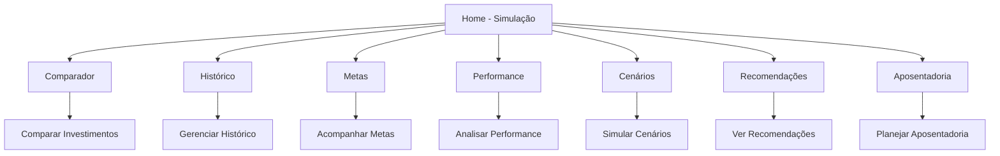
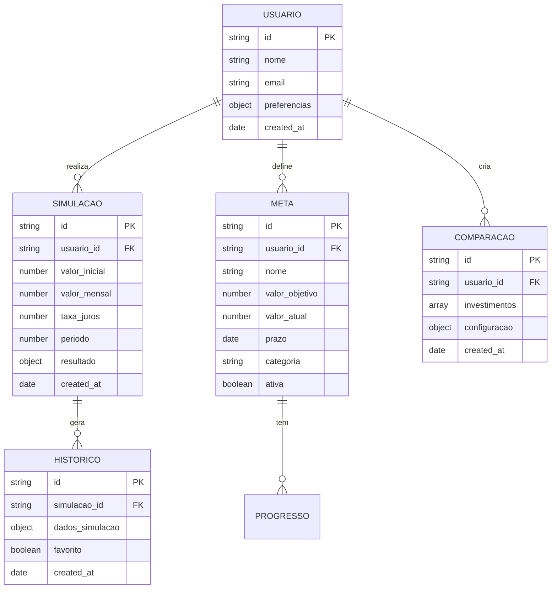

# Documento de Requisitos - Desenvolvimento de Seções da Home

## 1. Visão Geral do Projeto

Este documento especifica os requisitos para o desenvolvimento de 7 seções principais na página Home da aplicação Jurus (Calculadora de Juros Compostos). O objetivo é criar uma experiência completa e integrada para planejamento financeiro pessoal.

**Problema a resolver:** Usuários precisam de ferramentas abrangentes para planejamento financeiro que vão além de simulações básicas, incluindo comparação de investimentos, acompanhamento de metas, análise de performance e planejamento de aposentadoria.

**Público-alvo:** Investidores iniciantes e intermediários que buscam uma plataforma completa para gestão e planejamento financeiro pessoal.

**Valor do produto:** Centralizar todas as ferramentas de planejamento financeiro em uma única aplicação, com análises inteligentes e recomendações personalizadas.

## 2. Funcionalidades Principais

### 2.1 Papéis de Usuário

| Papel | Método de Registro | Permissões Principais |
|-------|-------------------|----------------------|
| Usuário Básico | Uso direto (sem registro) | Acesso a todas as funcionalidades básicas, dados salvos localmente |
| Usuário Avançado | Futuro: registro com email | Sincronização na nuvem, relatórios avançados, histórico ilimitado |

### 2.2 Módulos das Seções

Nossa aplicação Home consistirá das seguintes seções principais:

1. **Comparador**: Ferramenta para comparar diferentes opções de investimento
2. **Histórico**: Visualização e gestão do histórico de simulações
3. **Metas**: Definição e acompanhamento de objetivos financeiros
4. **Performance**: Dashboard analítico de performance dos investimentos
5. **Cenários**: Simulador de diferentes cenários econômicos
6. **Recomendações**: Sistema de recomendações baseado em IA
7. **Aposentadoria**: Planejamento específico para aposentadoria

### 2.3 Detalhes das Seções

| Seção | Módulo Principal | Descrição das Funcionalidades |
|-------|------------------|-------------------------------|
| **Comparador** | Análise Comparativa | Comparar até 5 investimentos simultaneamente. Visualizar diferenças de rentabilidade, risco e liquidez. Gráficos comparativos interativos. Exportar comparações. |
| **Histórico** | Gestão de Dados | Listar todas as simulações realizadas. Filtrar por data, valor, tipo. Favoritar simulações importantes. Recarregar simulações anteriores. Exportar histórico completo. |
| **Metas** | Planejamento Financeiro | Criar metas financeiras (casa, carro, viagem, etc.). Acompanhar progresso em tempo real. Calcular aportes necessários. Notificações de marcos atingidos. Timeline visual de metas. |
| **Performance** | Dashboard Analítico | Métricas de performance dos investimentos. Comparação com benchmarks (CDI, IPCA, Selic). Gráficos de evolução temporal. Análise de volatilidade e risco. Relatórios mensais/anuais. |
| **Cenários** | Simulação Avançada | Simular diferentes cenários econômicos (alta/baixa de juros, inflação). Análise de sensibilidade. Cenários otimista/realista/pessimista. Impacto de eventos econômicos. |
| **Recomendações** | Inteligência Artificial | Recomendações personalizadas baseadas no perfil. Sugestões de otimização de carteira. Alertas de oportunidades. Dicas educacionais contextuais. |
| **Aposentadoria** | Planejamento Previdenciário | Calcular valor necessário para aposentadoria. Simular diferentes idades de aposentadoria. Comparar INSS vs previdência privada. Projeções de renda mensal. Estratégias de acumulação. |

## 3. Fluxo Principal de Uso

### Fluxo do Usuário Básico:
1. Usuário acessa a aplicação
2. Navega entre as seções usando as abas superiores
3. Utiliza as ferramentas específicas de cada seção
4. Dados são salvos automaticamente no localStorage
5. Pode exportar dados e relatórios

### Fluxo de Navegação:


## 4. Design da Interface

### 4.1 Estilo de Design

**Elementos principais do design:**
- **Cores primárias:** Azul (#3B82F6), Roxo (#8B5CF6), Rosa (#EC4899)
- **Cores secundárias:** Cinza (#6B7280), Verde (#10B981), Vermelho (#EF4444)
- **Estilo dos botões:** Arredondados com gradientes e efeitos hover
- **Tipografia:** Inter (tamanhos: 12px-48px)
- **Layout:** Grid responsivo com cards e dashboards
- **Ícones:** Lucide React com estilo minimalista
- **Animações:** Framer Motion com transições suaves

### 4.2 Visão Geral das Seções

| Seção | Módulo | Elementos da Interface |
|-------|--------|------------------------|
| **Comparador** | Análise Comparativa | Tabela comparativa responsiva. Gráficos de barras e linhas. Cards de investimentos. Botões de ação (adicionar/remover). Filtros e ordenação. |
| **Histórico** | Lista de Simulações | Lista paginada com cards. Filtros por data/valor. Botões de ação (recarregar/favoritar/excluir). Modal de detalhes. Barra de busca. |
| **Metas** | Dashboard de Metas | Cards de metas com progress bars. Timeline visual. Formulário de criação de metas. Gráficos de progresso. Notificações de marcos. |
| **Performance** | Dashboard Analítico | Gráficos de performance (linha/área). Métricas em cards. Comparação com benchmarks. Filtros temporais. Relatórios exportáveis. |
| **Cenários** | Simulador Interativo | Sliders para variáveis econômicas. Gráficos de cenários múltiplos. Tabela de resultados. Botões de cenários pré-definidos. |
| **Recomendações** | Feed de Sugestões | Cards de recomendações. Sistema de likes/dislikes. Categorização por tipo. Botões de ação rápida. Tutorial integrado. |
| **Aposentadoria** | Calculadora Especializada | Formulário de dados pessoais. Gráficos de projeção. Comparativo INSS vs privada. Simulador de cenários de aposentadoria. |

### 4.3 Responsividade

**Desktop (1024px+):** Layout em grid com múltiplas colunas, navegação horizontal completa, gráficos expandidos
**Tablet (768px-1023px):** Layout adaptado com 2 colunas, navegação compacta, gráficos redimensionados
**Mobile (320px-767px):** Layout em coluna única, navegação em tabs móveis, gráficos otimizados para touch

## 5. Arquitetura Técnica

### 5.1 Estrutura de Componentes

```
src/components/
├── sections/
│   ├── ComparadorInvestimentos.tsx
│   ├── HistoricoSimulacoes.tsx
│   ├── MetasFinanceiras.tsx
│   ├── PerformanceDashboard.tsx
│   ├── CenariosSimulador.tsx
│   ├── RecomendacoesIA.tsx
│   └── AposentadoriaPlanner.tsx
├── shared/
│   ├── DataTable.tsx
│   ├── ChartContainer.tsx
│   ├── MetricCard.tsx
│   └── FilterPanel.tsx
└── ui/
    ├── Button.tsx
    ├── Card.tsx
    └── Modal.tsx
```

### 5.2 Tecnologias Utilizadas

- **Frontend:** React 18 + TypeScript + Vite
- **Estado:** Zustand para gerenciamento global
- **Estilização:** Tailwind CSS 3
- **Animações:** Framer Motion
- **Gráficos:** Recharts
- **Ícones:** Lucide React
- **Persistência:** localStorage (futuro: Supabase)

### 5.3 Definições de Rotas

| Rota | Propósito |
|------|-----------|
| /home?tab=simulacao | Página principal com simulação básica |
| /home?tab=comparador | Seção de comparação de investimentos |
| /home?tab=historico | Histórico de simulações |
| /home?tab=metas | Gestão de metas financeiras |
| /home?tab=performance | Dashboard de performance |
| /home?tab=cenarios | Simulador de cenários |
| /home?tab=recomendacoes | Recomendações personalizadas |
| /home?tab=aposentadoria | Planejamento de aposentadoria |

### 5.4 APIs e Integrações

**APIs Internas:**
```typescript
// Comparador
POST /api/comparador/adicionar
GET /api/comparador/listar
DELETE /api/comparador/remover

// Histórico
GET /api/historico/simulacoes
POST /api/historico/favoritar
DELETE /api/historico/excluir

// Metas
POST /api/metas/criar
PUT /api/metas/atualizar
GET /api/metas/progresso

// Performance
GET /api/performance/metricas
GET /api/performance/benchmarks

// Cenários
POST /api/cenarios/simular
GET /api/cenarios/predefinidos

// Recomendações
GET /api/recomendacoes/personalizadas
POST /api/recomendacoes/feedback

// Aposentadoria
POST /api/aposentadoria/calcular
GET /api/aposentadoria/projecoes
```

### 5.5 Modelo de Dados

#### 5.5.1 Definição do Modelo



#### 5.5.2 Estruturas de Dados (TypeScript)

```typescript
// Tipos principais
interface Simulacao {
  id: string;
  valorInicial: number;
  valorMensal: number;
  taxaJuros: number;
  periodo: number;
  modalidade?: Modalidade;
  resultado?: ResultadoSimulacao;
  createdAt: Date;
}

interface Meta {
  id: string;
  nome: string;
  valorObjetivo: number;
  valorAtual: number;
  prazo: Date;
  categoria: 'casa' | 'carro' | 'viagem' | 'educacao' | 'emergencia' | 'outros';
  ativa: boolean;
  progresso: number;
}

interface ComparacaoInvestimento {
  id: string;
  nome: string;
  tipo: 'renda_fixa' | 'renda_variavel' | 'fundos' | 'previdencia';
  taxaAnual: number;
  risco: 'baixo' | 'medio' | 'alto';
  liquidez: 'diaria' | 'mensal' | 'anual' | 'vencimento';
  valorMinimo: number;
}

interface CenarioEconomico {
  id: string;
  nome: string;
  selic: number;
  ipca: number;
  pib: number;
  cambio: number;
  descricao: string;
}

interface Recomendacao {
  id: string;
  tipo: 'otimizacao' | 'oportunidade' | 'alerta' | 'educacional';
  titulo: string;
  descricao: string;
  prioridade: 'baixa' | 'media' | 'alta';
  categoria: string;
  acao?: string;
}
```

### 5.6 Persistência de Dados

**localStorage (atual):**
- Simulações: `jurus_simulacoes`
- Metas: `jurus_metas`
- Histórico: `jurus_historico`
- Comparações: `jurus_comparacoes`
- Preferências: `jurus_preferencias`

**Supabase (futuro):**
- Tabelas: users, simulacoes, metas, historico, comparacoes
- Row Level Security (RLS) habilitado
- Sincronização automática entre dispositivos

## 6. Especificações de Implementação

### 6.1 Cronograma de Desenvolvimento

**Fase 1 (Semana 1-2):** Estrutura base e Comparador
**Fase 2 (Semana 3-4):** Histórico e Metas
**Fase 3 (Semana 5-6):** Performance e Cenários
**Fase 4 (Semana 7-8):** Recomendações e Aposentadoria
**Fase 5 (Semana 9-10):** Testes, otimização e polimento

### 6.2 Critérios de Aceitação

**Funcionalidade:**
- ✅ Todas as seções navegáveis via tabs
- ✅ Dados persistidos no localStorage
- ✅ Responsividade em todos os dispositivos
- ✅ Animações suaves entre transições
- ✅ Exportação de dados funcionando

**Performance:**
- ✅ Carregamento inicial < 3 segundos
- ✅ Transições entre abas < 500ms
- ✅ Lazy loading implementado
- ✅ Bundle size otimizado

**Acessibilidade:**
- ✅ Navegação por teclado
- ✅ ARIA labels implementados
- ✅ Contraste adequado
- ✅ Suporte a screen readers

### 6.3 Testes Necessários

**Testes Unitários:**
- Componentes individuais
- Hooks customizados
- Funções de cálculo
- Validações de formulário

**Testes de Integração:**
- Fluxo completo de cada seção
- Persistência de dados
- Navegação entre abas
- Responsividade

**Testes E2E:**
- Jornada completa do usuário
- Compatibilidade entre browsers
- Performance em dispositivos móveis

## 7. Considerações de Segurança e Performance

### 7.1 Segurança
- Validação de inputs no frontend
- Sanitização de dados antes da persistência
- Não exposição de dados sensíveis
- Implementação de CSP (Content Security Policy)

### 7.2 Performance
- Code splitting por seção
- Lazy loading de componentes pesados
- Memoização de cálculos complexos
- Otimização de re-renders
- Compressão de assets

### 7.3 Acessibilidade
- Suporte completo a WCAG 2.1 AA
- Navegação por teclado em todas as seções
- Textos alternativos para gráficos
- Indicadores visuais de foco
- Suporte a modo de alto contraste

Este documento serve como base para o desenvolvimento completo das seções solicitadas, garantindo uma implementação consistente, performática e acessível.