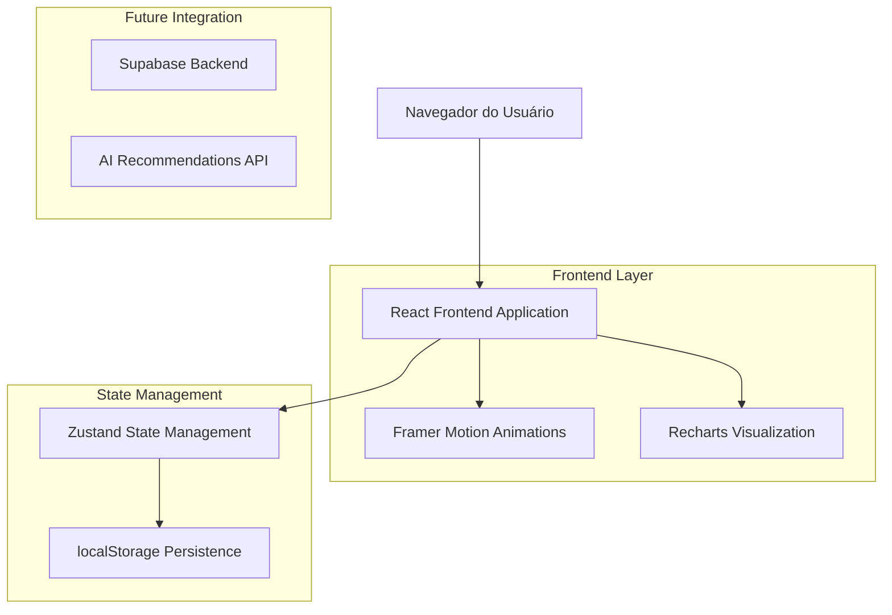

# Arquitetura Técnica - Seções da Home

## 1. Arquitetura Geral



## 2. Stack Tecnológico

**Frontend:**
- React@18 + TypeScript + Vite
- Tailwind CSS@3 + Framer Motion
- Recharts para visualizações
- Lucide React para ícones
- Zustand para estado global

**Persistência:**
- localStorage (atual)
- Supabase (planejado)

**Ferramentas de Desenvolvimento:**
- ESLint + Prettier
- Vitest para testes
- Storybook para documentação de componentes

## 3. Definições de Rotas

| Rota | Propósito |
|------|-----------|
| /home | Página principal com navegação por tabs |
| /home?tab=simulacao | Simulação básica de juros compostos |
| /home?tab=comparador | Comparação de investimentos |
| /home?tab=historico | Histórico de simulações |
| /home?tab=metas | Gestão de metas financeiras |
| /home?tab=performance | Dashboard de performance |
| /home?tab=cenarios | Simulador de cenários |
| /home?tab=recomendacoes | Recomendações IA |
| /home?tab=aposentadoria | Planejamento de aposentadoria |

## 4. APIs e Estruturas de Dados

### 4.1 Hooks Customizados

**useComparador**
```typescript
interface UseComparadorReturn {
  comparacoes: ComparacaoInvestimento[];
  adicionarInvestimento: (investimento: ComparacaoInvestimento) => void;
  removerInvestimento: (id: string) => void;
  calcularComparacao: () => ResultadoComparacao;
  limparComparacoes: () => void;
}
```

**useHistorico**
```typescript
interface UseHistoricoReturn {
  simulacoes: SimulacaoHistorico[];
  filtros: FiltrosHistorico;
  aplicarFiltro: (filtros: FiltrosHistorico) => void;
  favoritarSimulacao: (id: string) => void;
  excluirSimulacao: (id: string) => void;
  carregarSimulacao: (id: string) => void;
}
```

**useMetas**
```typescript
interface UseMetasReturn {
  metas: Meta[];
  criarMeta: (meta: Omit<Meta, 'id'>) => void;
  atualizarMeta: (id: string, dados: Partial<Meta>) => void;
  excluirMeta: (id: string) => void;
  calcularProgresso: (id: string) => number;
  verificarMarcos: () => Meta[];
}
```

**usePerformance**
```typescript
interface UsePerformanceReturn {
  metricas: MetricasPerformance;
  benchmarks: Benchmark[];
  calcularRetorno: (periodo: string) => number;
  compararComBenchmark: (benchmark: string) => ComparacaoPerformance;
  gerarRelatorio: (tipo: 'mensal' | 'anual') => RelatorioPerformance;
}
```

**useCenarios**
```typescript
interface UseCenariosReturn {
  cenarios: CenarioEconomico[];
  cenarioAtivo: CenarioEconomico;
  simularCenario: (cenario: CenarioEconomico) => ResultadoCenario;
  compararCenarios: (cenarios: CenarioEconomico[]) => ComparacaoCenarios;
  criarCenarioCustom: (parametros: ParametrosCenario) => CenarioEconomico;
}
```

**useRecomendacoes**
```typescript
interface UseRecomendacoesReturn {
  recomendacoes: Recomendacao[];
  carregarRecomendacoes: () => Promise<void>;
  avaliarRecomendacao: (id: string, avaliacao: 'like' | 'dislike') => void;
  aplicarRecomendacao: (id: string) => void;
  configurarPreferencias: (preferencias: PreferenciasIA) => void;
}
```

**useAposentadoria**
```typescript
interface UseAposentadoriaReturn {
  dadosPessoais: DadosAposentadoria;
  projecoes: ProjecaoAposentadoria;
  calcularAposentadoria: (dados: DadosAposentadoria) => ProjecaoAposentadoria;
  compararINSS: () => ComparacaoINSS;
  simularIdadeAposentadoria: (idade: number) => ResultadoSimulacao;
}
```

### 4.2 Estruturas de Dados Core

```typescript
// Comparador
interface ComparacaoInvestimento {
  id: string;
  nome: string;
  tipo: TipoInvestimento;
  taxaAnual: number;
  risco: NivelRisco;
  liquidez: TipoLiquidez;
  valorMinimo: number;
  custos: CustosInvestimento;
  projecao: ProjecaoInvestimento;
}

interface ResultadoComparacao {
  investimentos: ComparacaoInvestimento[];
  melhorRentabilidade: string;
  menorRisco: string;
  maiorLiquidez: string;
  recomendacao: string;
  graficos: DadosGrafico[];
}

// Histórico
interface SimulacaoHistorico {
  id: string;
  simulacao: Simulacao;
  resultado: ResultadoSimulacao;
  favorito: boolean;
  tags: string[];
  observacoes?: string;
  createdAt: Date;
}

interface FiltrosHistorico {
  dataInicio?: Date;
  dataFim?: Date;
  valorMinimo?: number;
  valorMaximo?: number;
  favoritos?: boolean;
  tags?: string[];
}

// Metas
interface Meta {
  id: string;
  nome: string;
  descricao?: string;
  valorObjetivo: number;
  valorAtual: number;
  prazo: Date;
  categoria: CategoriaMeta;
  prioridade: PrioridadeMeta;
  ativa: boolean;
  marcos: Marco[];
  estrategia: EstrategiaMeta;
}

interface Marco {
  id: string;
  nome: string;
  valor: number;
  data: Date;
  atingido: boolean;
}

// Performance
interface MetricasPerformance {
  retornoTotal: number;
  retornoAnualizado: number;
  volatilidade: number;
  sharpeRatio: number;
  maximoDrawdown: number;
  tempoRecuperacao: number;
  consistencia: number;
}

interface Benchmark {
  id: string;
  nome: string;
  simbolo: string;
  retornoAnual: number;
  volatilidade: number;
  categoria: 'renda_fixa' | 'renda_variavel' | 'inflacao' | 'cambio';
}

// Cenários
interface CenarioEconomico {
  id: string;
  nome: string;
  descricao: string;
  parametros: ParametrosEconomicos;
  probabilidade?: number;
  impacto: ImpactoCenario;
}

interface ParametrosEconomicos {
  selic: number;
  ipca: number;
  pib: number;
  cambio: number;
  desemprego: number;
  riscoPais: number;
}

// Recomendações
interface Recomendacao {
  id: string;
  tipo: TipoRecomendacao;
  titulo: string;
  descricao: string;
  justificativa: string;
  prioridade: PrioridadeRecomendacao;
  categoria: CategoriaRecomendacao;
  acao: AcaoRecomendacao;
  impactoEstimado: number;
  confianca: number;
  dataExpiracao?: Date;
}

// Aposentadoria
interface DadosAposentadoria {
  idadeAtual: number;
  idadeAposentadoria: number;
  rendaDesejada: number;
  patrimonioAtual: number;
  aportesMensais: number;
  tempoContribuicaoINSS: number;
  salarioAtual: number;
  expectativaVida: number;
}

interface ProjecaoAposentadoria {
  valorNecessario: number;
  aporteNecessario: number;
  rendaMensal: number;
  tempoAcumulacao: number;
  probabilidadeSucesso: number;
  cenarios: CenarioAposentadoria[];
}
```

## 5. Arquitetura de Componentes

### 5.1 Estrutura de Pastas

```
src/
├── components/
│   ├── sections/
│   │   ├── ComparadorInvestimentos/
│   │   │   ├── index.tsx
│   │   │   ├── ComparadorTable.tsx
│   │   │   ├── InvestimentoCard.tsx
│   │   │   ├── ComparacaoChart.tsx
│   │   │   └── AddInvestimentoModal.tsx
│   │   ├── HistoricoSimulacoes/
│   │   │   ├── index.tsx
│   │   │   ├── HistoricoList.tsx
│   │   │   ├── SimulacaoCard.tsx
│   │   │   ├── FiltrosPanel.tsx
│   │   │   └── DetalhesModal.tsx
│   │   ├── MetasFinanceiras/
│   │   │   ├── index.tsx
│   │   │   ├── MetaCard.tsx
│   │   │   ├── MetaTimeline.tsx
│   │   │   ├── CriarMetaModal.tsx
│   │   │   └── ProgressChart.tsx
│   │   ├── PerformanceDashboard/
│   │   │   ├── index.tsx
│   │   │   ├── MetricasCards.tsx
│   │   │   ├── PerformanceChart.tsx
│   │   │   ├── BenchmarkComparison.tsx
│   │   │   └── RelatorioModal.tsx
│   │   ├── CenariosSimulador/
│   │   │   ├── index.tsx
│   │   │   ├── CenarioSelector.tsx
│   │   │   ├── ParametrosSliders.tsx
│   │   │   ├── ResultadosChart.tsx
│   │   │   └── ComparacaoTable.tsx
│   │   ├── RecomendacoesIA/
│   │   │   ├── index.tsx
│   │   │   ├── RecomendacaoCard.tsx
│   │   │   ├── FeedRecomendacoes.tsx
│   │   │   ├── PreferenciasModal.tsx
│   │   │   └── AvaliacaoSystem.tsx
│   │   └── AposentadoriaPlanner/
│   │       ├── index.tsx
│   │       ├── DadosForm.tsx
│   │       ├── ProjecaoChart.tsx
│   │       ├── ComparacaoINSS.tsx
│   │       └── EstrategiasSugeridas.tsx
│   ├── shared/
│   │   ├── DataTable/
│   │   ├── ChartContainer/
│   │   ├── MetricCard/
│   │   ├── FilterPanel/
│   │   ├── ExportButton/
│   │   └── LoadingStates/
│   └── ui/
│       ├── Button/
│       ├── Card/
│       ├── Modal/
│       ├── Input/
│       ├── Select/
│       └── Slider/
├── hooks/
│   ├── sections/
│   │   ├── useComparador.ts
│   │   ├── useHistorico.ts
│   │   ├── useMetas.ts
│   │   ├── usePerformance.ts
│   │   ├── useCenarios.ts
│   │   ├── useRecomendacoes.ts
│   │   └── useAposentadoria.ts
│   └── shared/
│       ├── useLocalStorage.ts
│       ├── useExport.ts
│       ├── useCharts.ts
│       └── useNotifications.ts
├── utils/
│   ├── calculations/
│   │   ├── comparador.ts
│   │   ├── performance.ts
│   │   ├── cenarios.ts
│   │   └── aposentadoria.ts
│   ├── formatters/
│   │   ├── currency.ts
│   │   ├── percentage.ts
│   │   └── dates.ts
│   └── validators/
│       ├── forms.ts
│       └── data.ts
└── types/
    ├── comparador.ts
    ├── historico.ts
    ├── metas.ts
    ├── performance.ts
    ├── cenarios.ts
    ├── recomendacoes.ts
    └── aposentadoria.ts
```

### 5.2 Padrões de Implementação

**Lazy Loading:**
```typescript
// Implementação de lazy loading para cada seção
const LazyComparador = lazy(() => import('./sections/ComparadorInvestimentos'));
const LazyHistorico = lazy(() => import('./sections/HistoricoSimulacoes'));
const LazyMetas = lazy(() => import('./sections/MetasFinanceiras'));
// ... outras seções

// Uso com Suspense
<Suspense fallback={<SkeletonLoader />}>
  <LazyComparador />
</Suspense>
```

**Memoização:**
```typescript
// Componentes memoizados para performance
const MemoizedComparador = memo(ComparadorInvestimentos);
const MemoizedHistorico = memo(HistoricoSimulacoes);

// Hooks com useMemo para cálculos pesados
const resultadoComparacao = useMemo(() => {
  return calcularComparacao(investimentos);
}, [investimentos]);
```

**Error Boundaries:**
```typescript
// Error boundary para cada seção
<ErrorBoundary fallback={<ErrorFallback />}>
  <ComparadorInvestimentos />
</ErrorBoundary>
```

## 6. Modelo de Dados

### 6.1 Schema do localStorage

```typescript
interface LocalStorageSchema {
  jurus_simulacoes: Simulacao[];
  jurus_historico: SimulacaoHistorico[];
  jurus_metas: Meta[];
  jurus_comparacoes: ComparacaoInvestimento[];
  jurus_performance: MetricasPerformance;
  jurus_cenarios: CenarioEconomico[];
  jurus_recomendacoes: Recomendacao[];
  jurus_aposentadoria: DadosAposentadoria;
  jurus_preferencias: PreferenciasUsuario;
}
```

### 6.2 Migração para Supabase (Futuro)

```sql
-- Tabelas principais
CREATE TABLE users (
  id UUID PRIMARY KEY DEFAULT gen_random_uuid(),
  email VARCHAR(255) UNIQUE NOT NULL,
  name VARCHAR(100) NOT NULL,
  preferences JSONB DEFAULT '{}',
  created_at TIMESTAMP WITH TIME ZONE DEFAULT NOW()
);

CREATE TABLE simulacoes (
  id UUID PRIMARY KEY DEFAULT gen_random_uuid(),
  user_id UUID REFERENCES users(id),
  valor_inicial DECIMAL(15,2) NOT NULL,
  valor_mensal DECIMAL(15,2) NOT NULL,
  taxa_juros DECIMAL(5,2) NOT NULL,
  periodo INTEGER NOT NULL,
  resultado JSONB,
  created_at TIMESTAMP WITH TIME ZONE DEFAULT NOW()
);

CREATE TABLE metas (
  id UUID PRIMARY KEY DEFAULT gen_random_uuid(),
  user_id UUID REFERENCES users(id),
  nome VARCHAR(200) NOT NULL,
  valor_objetivo DECIMAL(15,2) NOT NULL,
  valor_atual DECIMAL(15,2) DEFAULT 0,
  prazo DATE NOT NULL,
  categoria VARCHAR(50) NOT NULL,
  ativa BOOLEAN DEFAULT true,
  created_at TIMESTAMP WITH TIME ZONE DEFAULT NOW()
);

CREATE TABLE comparacoes (
  id UUID PRIMARY KEY DEFAULT gen_random_uuid(),
  user_id UUID REFERENCES users(id),
  investimentos JSONB NOT NULL,
  configuracao JSONB DEFAULT '{}',
  created_at TIMESTAMP WITH TIME ZONE DEFAULT NOW()
);

-- Índices para performance
CREATE INDEX idx_simulacoes_user_id ON simulacoes(user_id);
CREATE INDEX idx_simulacoes_created_at ON simulacoes(created_at DESC);
CREATE INDEX idx_metas_user_id ON metas(user_id);
CREATE INDEX idx_metas_ativa ON metas(ativa);

-- RLS (Row Level Security)
ALTER TABLE simulacoes ENABLE ROW LEVEL SECURITY;
ALTER TABLE metas ENABLE ROW LEVEL SECURITY;
ALTER TABLE comparacoes ENABLE ROW LEVEL SECURITY;

-- Políticas de segurança
CREATE POLICY "Users can view own simulacoes" ON simulacoes
  FOR SELECT USING (auth.uid() = user_id);

CREATE POLICY "Users can insert own simulacoes" ON simulacoes
  FOR INSERT WITH CHECK (auth.uid() = user_id);
```

## 7. Performance e Otimização

### 7.1 Estratégias de Performance

**Code Splitting:**
- Cada seção carregada sob demanda
- Chunks separados para bibliotecas pesadas
- Preload inteligente baseado na navegação

**Memoização:**
- Componentes com React.memo()
- Cálculos pesados com useMemo()
- Callbacks estáveis com useCallback()

**Virtualização:**
- Listas grandes com react-window
- Tabelas virtualizadas para histórico
- Gráficos com lazy rendering

### 7.2 Métricas de Performance

**Targets:**
- First Contentful Paint: < 1.5s
- Largest Contentful Paint: < 2.5s
- Time to Interactive: < 3.5s
- Cumulative Layout Shift: < 0.1

**Monitoramento:**
- Web Vitals integrado
- Performance Observer API
- Bundle analyzer para otimização

## 8. Testes e Qualidade

### 8.1 Estratégia de Testes

**Testes Unitários (Vitest):**
```typescript
// Exemplo de teste para hook
describe('useComparador', () => {
  it('should add investment correctly', () => {
    const { result } = renderHook(() => useComparador());
    
    act(() => {
      result.current.adicionarInvestimento(mockInvestimento);
    });
    
    expect(result.current.comparacoes).toHaveLength(1);
  });
});
```

**Testes de Integração:**
```typescript
// Exemplo de teste de componente
describe('ComparadorInvestimentos', () => {
  it('should display comparison results', async () => {
    render(<ComparadorInvestimentos />);
    
    fireEvent.click(screen.getByText('Adicionar Investimento'));
    fireEvent.click(screen.getByText('Comparar'));
    
    await waitFor(() => {
      expect(screen.getByText('Resultado da Comparação')).toBeInTheDocument();
    });
  });
});
```

**Testes E2E (Playwright):**
```typescript
// Exemplo de teste end-to-end
test('complete investment comparison flow', async ({ page }) => {
  await page.goto('/home?tab=comparador');
  
  await page.click('[data-testid="add-investment"]');
  await page.fill('[data-testid="investment-name"]', 'CDB');
  await page.fill('[data-testid="investment-rate"]', '12');
  await page.click('[data-testid="save-investment"]');
  
  await page.click('[data-testid="compare-button"]');
  
  await expect(page.locator('[data-testid="comparison-results"]')).toBeVisible();
});
```

### 8.2 Qualidade de Código

**ESLint + Prettier:**
- Regras específicas para React/TypeScript
- Formatação automática
- Pre-commit hooks

**TypeScript:**
- Strict mode habilitado
- Tipos explícitos para todas as interfaces
- Validação em tempo de compilação

**Acessibilidade:**
- Testes automatizados com axe-core
- Navegação por teclado testada
- Contraste verificado automaticamente

Este documento fornece a base técnica completa para implementação das seções solicitadas, garantindo qualidade, performance e manutenibilidade do código.