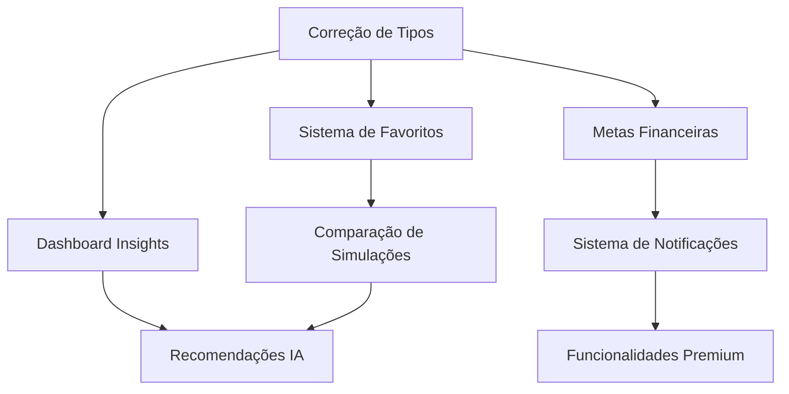

# Análise de Funcionalidades Não Implementadas - Plataforma Jurus

## 1. Visão Geral do Problema

A plataforma Jurus possui uma interface visual rica e completa, mas muitas funcionalidades existem apenas como componentes visuais sem a lógica de negócio implementada. Esta análise identifica sistematicamente todas as lacunas de implementação baseada nos erros de TypeScript e análise de código.

## 2. Funcionalidades Principais Não Implementadas

### 2.1 Sistema de Favoritos (SistemaFavoritos.tsx)

**Status**: Interface completa, lógica parcialmente implementada

**Problemas Identificados**:
- Incompatibilidade de tipos entre `ResultadoSimulacao` e propriedades esperadas
- Propriedades `saldoFinal` não existe (deveria ser `valorFinal`)
- Propriedades `rendimentoTotal` não implementada
- Propriedades `valorInicial`, `periodo`, `modalidade` ausentes no tipo `Simulacao`

**Erros Específicos**:
```typescript
// Erro: Property 'saldoFinal' does not exist on type 'ResultadoSimulacao'
simulacao.resultado.saldoFinal // Deveria ser valorFinal

// Erro: Property 'valorInicial' does not exist on type 'Simulacao'
simulacao.valorInicial // Tipo Simulacao não tem esta propriedade
```

**Funcionalidades Faltantes**:
- [ ] Persistência de favoritos no localStorage
- [ ] Sistema de tags e categorização
- [ ] Comparação entre simulações favoritas
- [ ] Exportação de favoritos
- [ ] Análise automática de performance dos favoritos

### 2.2 Recomendações de IA (RecomendacoesIA.tsx)

**Status**: Interface completa, algoritmos não implementados

**Problemas Identificados**:
- Hook `useRecomendacoesIA` retorna dados mockados
- Algoritmos de machine learning não implementados
- Análise de perfil do investidor superficial

**Funcionalidades Faltantes**:
- [ ] Algoritmo de análise de perfil de risco real
- [ ] Sistema de recomendações baseado em histórico
- [ ] Integração com dados de mercado em tempo real
- [ ] Análise de correlação entre investimentos
- [ ] Sistema de alertas inteligentes
- [ ] Otimização de carteira usando algoritmos de Markowitz

### 2.3 Metas Financeiras (MetasFinanceiras.tsx)

**Status**: Interface completa, lógica de negócio não implementada

**Problemas Identificados**:
- Incompatibilidade de tipos de status (`"em_andamento"` vs `"ativa"`)
- Componente `TimelineMetas` não implementado
- Hook `useMetas` não existe
- Tipos de notificação incompatíveis

**Erros Específicos**:
```typescript
// Erro: Type '"em_andamento"' is not assignable to type '"ativa" | "pausada" | "concluida" | "cancelada"'
status: "em_andamento" // Tipo não definido corretamente

// Erro: Cannot find name 'useMetas'
const { metas } = useMetas(); // Hook não implementado
```

**Funcionalidades Faltantes**:
- [ ] Cálculo automático de progresso das metas
- [ ] Sistema de notificações por prazo
- [ ] Análise de viabilidade de metas
- [ ] Sugestões de ajuste de contribuições
- [ ] Timeline visual de progresso
- [ ] Integração com simulações de juros compostos

### 2.4 Sistema de Temas (SistemaTemas.tsx)

**Status**: Interface parcial, funcionalidades avançadas não implementadas

**Problemas Identificados**:
- Ícones não existentes no Lucide React (`ColorWheelIcon`, `Eyedropper`)
- Funcionalidades de personalização não implementadas

**Funcionalidades Faltantes**:
- [ ] Editor de cores personalizado
- [ ] Temas dinâmicos baseados em horário
- [ ] Sincronização de temas entre dispositivos
- [ ] Temas de alto contraste para acessibilidade
- [ ] Exportação/importação de temas personalizados

### 2.5 Dashboard de Insights (DashboardInsights.tsx)

**Status**: Interface completa, análises não implementadas

**Problemas Identificados**:
- Propriedade `asChild` não existe em componentes de diálogo
- Dados de insights são mockados

**Funcionalidades Faltantes**:
- [ ] Análise de padrões de investimento
- [ ] Detecção de tendências automática
- [ ] Correlação entre variáveis econômicas
- [ ] Previsões baseadas em machine learning
- [ ] Alertas de oportunidades de mercado
- [ ] Análise comportamental do usuário

### 2.6 Simulador de Cenários (SimuladorCenarios.tsx)

**Status**: Interface completa, cálculos avançados não implementados

**Problemas Identificados**:
- Funções `formatarMoeda` e `formatarPercentual` não encontradas
- Cenários complexos não calculados corretamente

**Funcionalidades Faltantes**:
- [ ] Simulação Monte Carlo
- [ ] Análise de sensibilidade
- [ ] Cenários de stress testing
- [ ] Simulação de diferentes condições econômicas
- [ ] Análise de probabilidades de sucesso
- [ ] Comparação estatística entre cenários

### 2.7 Sistema de Educação (SistemaEducacao.tsx)

**Status**: Interface básica, conteúdo e progressão não implementados

**Problemas Identificados**:
- Tipos de atividades de estudo incompatíveis
- Sistema de gamificação não funcional

**Funcionalidades Faltantes**:
- [ ] Conteúdo educacional estruturado
- [ ] Sistema de progressão e níveis
- [ ] Quizzes interativos
- [ ] Certificações
- [ ] Recomendações personalizadas de conteúdo
- [ ] Tracking de progresso de aprendizado

### 2.8 Funcionalidades Premium (FuncionalidadesPremium.tsx)

**Status**: Interface completa, validações e restrições não implementadas

**Problemas Identificados**:
- Tipos de relatório incompatíveis
- Validações de plano premium não funcionais

**Funcionalidades Faltantes**:
- [ ] Sistema de autenticação e autorização
- [ ] Validação de planos de assinatura
- [ ] Limitações por tipo de usuário
- [ ] Relatórios avançados em PDF
- [ ] Análises exclusivas para premium
- [ ] Suporte prioritário

## 3. Problemas de Tipos e Interfaces

### 3.1 Incompatibilidades Críticas

**ResultadoSimulacao vs Propriedades Esperadas**:
```typescript
// Atual (incorreto)
interface ResultadoSimulacao {
  valorFinal: number;
  // saldoFinal não existe
  // rendimentoTotal não existe
}

// Esperado pelos componentes
interface ResultadoSimulacao {
  valorFinal: number;
  saldoFinal: number; // Alias para valorFinal
  rendimentoTotal: number; // Calculado: valorFinal - valorInicial
  jurosGanhos: number;
  // ... outras propriedades
}
```

**Simulacao vs SimulacaoInput**:
```typescript
// Problema: Componentes esperam propriedades que não existem
interface Simulacao {
  // Faltam propriedades básicas:
  valorInicial: number;
  valorMensal: number;
  periodo: number;
  modalidade: string;
  // ... outras propriedades
}
```

### 3.2 Hooks Não Implementados

**Hooks Faltantes**:
- `useMetas()` - Gerenciamento de metas financeiras
- `useEducacao()` - Sistema educacional
- `usePremium()` - Funcionalidades premium
- `useIA()` - Recomendações de IA

## 4. Funcionalidades de Backend/Lógica

### 4.1 Cálculos Avançados Não Implementados

**Algoritmos Faltantes**:
- [ ] Simulação Monte Carlo para análise de risco
- [ ] Otimização de carteira (Teoria Moderna do Portfólio)
- [ ] Cálculo de Value at Risk (VaR)
- [ ] Análise de correlação entre ativos
- [ ] Projeções com diferentes cenários econômicos

### 4.2 Persistência de Dados

**Sistemas de Armazenamento Faltantes**:
- [ ] Banco de dados para histórico de simulações
- [ ] Cache inteligente para performance
- [ ] Sincronização entre dispositivos
- [ ] Backup automático de dados
- [ ] Versionamento de simulações

### 4.3 Algoritmos de IA/ML

**Funcionalidades de Inteligência Artificial**:
- [ ] Análise de padrões de comportamento
- [ ] Recomendações personalizadas
- [ ] Detecção de anomalias
- [ ] Previsão de tendências
- [ ] Classificação automática de perfil de risco

### 4.4 Sistema de Notificações

**Notificações Não Implementadas**:
- [ ] Alertas de metas próximas ao vencimento
- [ ] Notificações de oportunidades de mercado
- [ ] Lembretes de contribuições mensais
- [ ] Alertas de rebalanceamento de carteira

## 5. Priorização de Implementação

### 5.1 Funcionalidades Críticas (Prioridade Alta)

1. **Correção de Tipos e Interfaces** (1-2 semanas)
   - Alinhar tipos `ResultadoSimulacao` e `Simulacao`
   - Implementar propriedades faltantes
   - Corrigir incompatibilidades de tipos

2. **Sistema de Favoritos Funcional** (2-3 semanas)
   - Persistência no localStorage
   - Comparação entre simulações
   - Sistema básico de tags

3. **Cálculos Avançados** (3-4 semanas)
   - Simulação de cenários básicos
   - Cálculos de inflação precisos
   - Análise de sensibilidade

### 5.2 Funcionalidades Importantes (Prioridade Média)

4. **Metas Financeiras** (3-4 semanas)
   - Cálculo de progresso automático
   - Sistema de notificações básico
   - Timeline de metas

5. **Dashboard de Insights** (4-5 semanas)
   - Análise de padrões básicos
   - Métricas de performance
   - Alertas simples

6. **Sistema de Educação** (4-6 semanas)
   - Conteúdo educacional básico
   - Sistema de progressão
   - Quizzes interativos

### 5.3 Funcionalidades Nice-to-Have (Prioridade Baixa)

7. **Recomendações de IA** (6-8 semanas)
   - Algoritmos de machine learning
   - Análise de perfil avançada
   - Otimização de carteira

8. **Funcionalidades Premium** (4-6 semanas)
   - Sistema de autenticação
   - Relatórios avançados
   - Análises exclusivas

9. **Sistema de Temas Avançado** (2-3 semanas)
   - Editor de cores
   - Temas dinâmicos
   - Personalização completa

## 6. Dependências Entre Funcionalidades

### 6.1 Dependências Críticas



### 6.2 Ordem de Implementação Recomendada

1. **Fase 1 - Fundação** (4-6 semanas)
   - Correção de tipos e interfaces
   - Sistema de favoritos básico
   - Cálculos avançados

2. **Fase 2 - Funcionalidades Core** (6-8 semanas)
   - Metas financeiras
   - Dashboard de insights
   - Sistema de educação básico

3. **Fase 3 - Funcionalidades Avançadas** (8-12 semanas)
   - Recomendações de IA
   - Funcionalidades premium
   - Sistema de temas avançado

## 7. Estimativas de Complexidade

### 7.1 Complexidade por Funcionalidade

| Funcionalidade | Complexidade | Tempo Estimado | Recursos Necessários |
|----------------|--------------|----------------|---------------------|
| Correção de Tipos | Baixa | 1-2 semanas | 1 Dev Frontend |
| Sistema de Favoritos | Média | 2-3 semanas | 1 Dev Frontend |
| Metas Financeiras | Média | 3-4 semanas | 1 Dev Frontend |
| Dashboard Insights | Alta | 4-5 semanas | 1 Dev Frontend + 1 Dev Backend |
| Recomendações IA | Muito Alta | 6-8 semanas | 1 Dev ML + 1 Dev Backend |
| Sistema Educação | Média | 4-6 semanas | 1 Dev Frontend + 1 Designer |
| Funcionalidades Premium | Alta | 4-6 semanas | 1 Dev Fullstack |

### 7.2 Recursos Totais Estimados

- **Tempo Total**: 24-36 semanas (6-9 meses)
- **Equipe Recomendada**: 2-3 desenvolvedores + 1 designer
- **Orçamento Estimado**: Médio-Alto (dependendo da equipe)

## 8. Recomendações de Implementação

### 8.1 Estratégia de Desenvolvimento

1. **Abordagem Incremental**: Implementar funcionalidades em fases
2. **Testes Contínuos**: Cada funcionalidade deve ter testes unitários
3. **Documentação**: Manter documentação atualizada
4. **Feedback do Usuário**: Coletar feedback em cada fase

### 8.2 Tecnologias Recomendadas

**Frontend**:
- Manter React + TypeScript
- Adicionar bibliotecas para cálculos financeiros
- Implementar state management robusto (Zustand/Redux)

**Backend** (se necessário):
- Node.js + Express ou Python + FastAPI
- Banco de dados: PostgreSQL ou MongoDB
- Cache: Redis

**IA/ML**:
- Python + scikit-learn para algoritmos básicos
- TensorFlow.js para ML no frontend
- APIs de dados financeiros (Alpha Vantage, Yahoo Finance)

## 9. Conclusão

A plataforma Jurus possui uma base sólida de interface, mas necessita de implementação significativa de lógica de negócio. A priorização sugerida permite entregar valor incremental aos usuários enquanto constrói uma base técnica robusta para funcionalidades avançadas.

**Próximos Passos Imediatos**:
1. Corrigir incompatibilidades de tipos
2. Implementar sistema de favoritos funcional
3. Adicionar cálculos avançados básicos
4. Estabelecer roadmap detalhado para próximas fases

Esta análise serve como base para planejamento de desenvolvimento e alocação de recursos para transformar a plataforma Jurus de um protótipo visual em uma aplicação financeira completa e funcional.